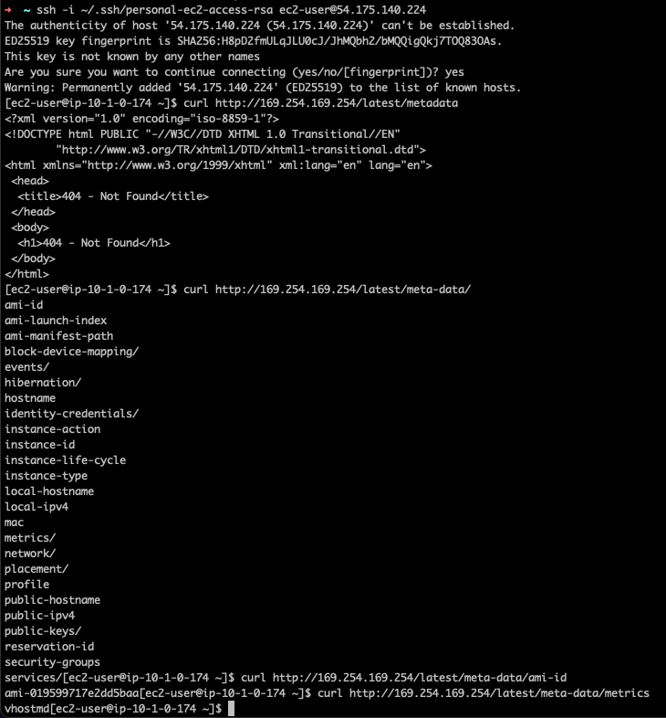

# Current Architecture


# The challenge
1. 1 VPC – 10.1.0.0/16
1. 4 subnets (spread evenly across two availability zones)
    1. Sub1 – 10.1.0.0/24 (should be accessible from internet)
    1. Sub2 – 10.1.1.0/24 (should be accessible from internet)
    1. Sub3 – 10.1.2.0/24 (should NOT be accessible from internet)
    1. Sub4 – 10.1.3.0/24 (should NOT be accessible from internet)
1. 1 EC2 instance running Red Hat Linux in subnet 2
    1. 20 GB storage
    1. t2.micro
1. 1 auto scaling group (ASG) that will spread out instances across subnets sub3 and sub4
    1. Use Red Hat Linux
    1. 20 GB storage
    1. Script the installation of Apache web server (httpd) on these instances
    1. 2 minimum, 6 maximum hosts
    1. t2.micro
1. 1 application load balancer (ALB) that listens on TCP port 80 (HTTP) and forwards traffic to the ASG in subnets sub3 and sub4
1. Security groups should be used to allow necessary traffic - these are going to be interesting. They will need to have outputs, that root main.tf will have to import with the module. thing and be passed into the different modules that they'll see as variables. Maybe save this to last
1. 1 S3 bucket with two folders and the following lifecycle policies
    1. “Images” folder - move objects older than 90 days to glacier
    1. “Logs” folder - delete objects older than 90 days

- Able to successfully get to the bastion and 


# Resources used
If I directly referenced the website, almost every site is listed. If I visited while searching for specific information, I may or may not have recorded it
- Started with [this](https://spacelift.io/blog/terraform-output) article that linked to [this](https://github.com/spacelift-io-blog-posts/Blog-Technical-Content/tree/master/terraform-output/modules) Github.
- Understanding how variables work. Outputs can be read by parent modules. Variables can be read by child modules. It does not seem like outputs can be read by 'sibling' modules
- Module = each of the .tf files
- Installed: zsh, oh my zsh, visual studio code (replaced by atom), brew, terraform, github, aws-vault, awscli
- [This article](https://spacelift.io/blog/terraform-output) for heavy inspiration of designing the bones, then building out from there
- [Google search](https://www.google.com/search?q=error%3A+src+refspec+main+does+not+match+any+error%3A+failed+to+push+some+refs+to+when+pushing+main+to+new+repo&oq=error%3A+src+refspec+main+does+not+match+any+error%3A+failed+to+push+some+refs+to+when+pushing+main+to+new+repo&aqs=chrome..69i57j69i58.4557j0j1&sourceid=chrome&ie=UTF-8) to troubleshoot how to push to Github. Turns out I had to commit files first, then I could push. Also had to set git config username and name to be able to push after committing
- [Looked up](https://registry.terraform.io/providers/hashicorp/aws/latest/docs/resources/nat_gateway) how to make NAT gateway
- Verified AZ names [link](https://www.google.com/search?q=availability+zones+in+aws+us-east-1&oq=availability+zones+in+aws+us-east-1&aqs=chrome..69i57.7210j0j1&sourceid=chrome&ie=UTF-8)
- Found out how to pull RHEL AMIs from [here](https://gmusumeci.medium.com/how-to-deploy-a-red-hat-enterprise-linux-rhel-ec2-instance-in-aws-using-terraform-6570ad6ee19f)
- [Terraform instance docs](https://registry.terraform.io/providers/hashicorp/aws/latest/docs/resources/instance) for ebs and key conventions
- Referenced [this article](https://thecodinginterface.com/blog/terraform-linux-ec2-ebs/) to get practical examples of increasing block storage on instance
- Used [this article](https://adamtheautomator.com/terraform-autoscaling-group/) for in-depth understanding of building the ASG
- [How to](https://registry.terraform.io/providers/hashicorp/aws/latest/docs/resources/key_pair) create a key pair for access instances
- Specific [steps](https://docs.tritondatacenter.com/public-cloud/getting-started/ssh-keys/generating-an-ssh-key-manually/manually-generating-your-ssh-key-in-mac-os-x) on creating RSA key
- [Terraform launch_configuration docs](https://registry.terraform.io/providers/hashicorp/aws/latest/docs/resources/launch_configuration) to verify user_data is the same as in the regular instance creation
- Importing the public key in the root `main.tf` wasn't playing nice, so I uploaded the key I made for that purpose into the AWS console and made vars to refer to the name
- [This forum](https://stackoverflow.com/questions/55373524/how-to-add-lifecycle-rules-to-an-s3-bucket-using-terraform) for creating s3 and defining lifecycle policies
- [How to](https://stackoverflow.com/questions/68397972/how-to-use-aws-account-id-variable-in-terraform) use account ID in terraform
- Looked at [this](https://hands-on.cloud/terraform-recipe-managing-auto-scaling-groups-and-load-balancers/) for inspiration, but it was based on ELB, which is out of scope for this challenge
- [This article](https://stackoverflow.com/questions/61512718/why-does-terraform-fail-with-an-argument-named-flow-log-destination-type-is-n) while troubleshooting when running terraform plan on the Intel Mac, getting an error with the `aws_autoscaling` module where all the variables are saying `error: unsupported argument` and further down `an argument named <variable_name> is not expected here` From what I can tell, the variables all use the same naming, and look the same as other modules that don't appear to be failing
- Talked with Ryan and Chris and discovered that `variables.tf` files are defined to let the `main.tf` file in the directory know what variables can be passed in
- When running terraform plan after updating variable files, there was an error of 'no module call named "vpc" is declared in the root module' and pointed at lines 33 and 34 being culprits. I added in a module folder and put everything below it, since that's what the Spacelift article did. Ran terraform init after committing the changes and ran terraform plan. Still running into same issue. Found out that `module` needs to point at the module in the root `main.tf`, not the directories under modules. Make sense, and now it'll be more memorable...
- Used [this](https://dev.betterdoc.org/infrastructure/2020/02/04/setting-up-a-nat-gateway-on-aws-using-terraform.html) article to figure out the relationship between EIP and nat gateway in terraform
- Found this article from Hashicorp about setting up an ALB [here](https://learn.hashicorp.com/tutorials/terraform/aws-asg)
- Terraform AWS ALB page [here](https://registry.terraform.io/providers/hashicorp/aws/latest/docs/resources/lb)
- Took the suggestion here to sort an error with the EC2 security group [here](https://www.reddit.com/r/Terraform/comments/c77ai2/vpc_security_group_ids_examples/)
- Make terraform use a named AWS profile [here](https://registry.terraform.io/providers/hashicorp/aws/latest/docs)
- Had to use [aws-vault](https://github.com/99designs/aws-vault) on Intel Mac and provide my personal AWS credentials, then ran terraform plan
- TERRAFORM PLAN WORKS!! HORRAY!!
- For the networking diagram, looked at lots of diagrams on google images to get an idea how to flesh it out
- [Forum](https://stackoverflow.com/questions/41604263/how-do-i-display-local-image-in-markdown) to link .png in .md
- Looked at the [article](https://www.terraform.io/language/meta-arguments/depends_on) on depends_on. `terraform plan` failed saying the ASG couldn't find the ALB
- Used [this page](https://docs.aws.amazon.com/AWSEC2/latest/UserGuide/instancedata-data-retrieval.html) for the command to look up instance metadata
- According to [this](github.com/terraform-aws-modules/terraform-aws-autoscaling/issues/16) github thread, load_balancers refers to classic load balancers, and target_group_arn must be used instead and point at the ALB target group
- [Stack overflow](https://stackoverflow.com/questions/50677641/add-asg-instances-in-target-group-via-terraform) said to put target_group_arns in brackets and push in a variable for the arns
- The stack overflow article may have been misleading. Looking at terraform [documentation](https://learn.hashicorp.com/tutorials/terraform/aws-asg?utm_source=WEBSITE&utm_medium=WEB_IO&utm_offer=ARTICLE_PAGE&utm_content=DOCS) it uses the aws_autoscaling_attachment resource to do the attaching, which I already had defined, so I just removed the target_group_arns in the ASG resource
- Not able to access ASG instances. Even with an allow all rule in a security grouop, unable to SSH or get HTTP traffic to them.


## Troubleshooting running on M1 Mac
For now, workaround is use Intel Mac

- I tried running terraform init, and got the error
```
│ Error: Incompatible provider version
│
│ Provider registry.terraform.io/hashicorp/aws v3.16.0 does not have a package available for your current platform, darwin_arm64.
```
- found [this article](https://discuss.hashicorp.com/t/template-v2-2-0-does-not-have-a-package-available-mac-m1/35099/3)
- Then did `brew uninstall terraform`, `brew install kreuzwerker/taps/m1-terraform-provider-helper`, got an error, so `softwareupdate --all --install --force`, which said everything up to date, so ran `sudo rm -rf /Library/Developer/CommandLineTools` then `sudo xcode-select --install`. Retried the m1 helper which worked, so ran `brew tap hashicorp/tap`, `brew install hashicorp/tap/terraform`, `m1-terraform-provider-helper activate`,`m1-terraform-provider-helper install hashicorp/template -v v2.2.0`, then `terraform --version` which said it was on darwin, but still has the same error... Uninstalled terraform `brew uninstall terraform` and tried `brew tap hashicorp/tap`, `brew install hashicorp/tap/terraform`, and `m1-terraform-provider-helper install hashicorp/template -v v2.2.0` again. Same error :(. Tried `terraform init --upgrade` from [here](https://stackoverflow.com/questions/66281882/how-can-i-get-terraform-init-to-run-on-my-apple-silicon-macbook-pro-for-the-go) and no dice.
- added templatefile() to asg ec2 templatefile, same [error](https://cloudonaut.io/terraform-incompatible-provider-version/). Also ran `terraform state rm data.template_file.userdata` and no state file was found
- Need to totally delete all terraform things (not just brew uninstall) and try again tomorrow
- New day, starting over. `brew uninstall terraform`, looked at [this article](https://discuss.hashicorp.com/t/template-v2-2-0-does-not-have-a-package-available-mac-m1/35099/7) then `brew install tfenv`, `tfenv list-remote`, `tfenv install`. Then ran `brew install kreuzwerker/taps/m1-terraform-provider-helper`, `m1-terraform-provider-helper activate` which both did nothing, since already installed, then `m1-terraform-provider-helper install hashicorp/template -v v2.2.0` and it said version could not be resolved. Set version `tfenv use 1.0.9` since the guy in the forum suggested that one specifically. Ran `m1-terraform-provider-helper install hashicorp/template -v v2.2.0` and it worked. Installed terraform `brew install terraform` and got an error saying to run `brew unlink tfenv` then `brew install terraform` then had to reinstall tfenv again. It was already installed, and said I needed to `brew link tfenv`, so I did that, then `brew unlink terraform` then `brew link tfenv` again, then `tfenv use 1.0.9`. Ran terraform init and it came back with incompatible provider version again......... for now, going to just run code from the intel mac from work and develop on my m1 mac.
- also, vscode decided to stop working, so I'm developing on atom now.


# Further learning
1. Naming convention for resources was silly. Converted from naming them each with a variable to simply combining a string and tagging it based on environment, e.g. dev, test
1. using count meta argument to condense the amount of code duplication
    1. Public Subnets
        1. `length(var.availability_zones)` checks how many availability zones have been defined in the variables
        1. `count.index` references the `count` block under the resource that, in the case of the main.tf under vpc, line 20, returns a count of the result of `length(var.availability_zones)`
        1. `element` rolls over and iterates through the available values. E.g., if only count.index[0] and count.index[1] have values, and index[2] is called, it will start at the beginning and return the value of count.index[0]
    1. Private subnets
        1. only a small change here - since the subnets can't have overlapping cidr addresses, the use of `count.index + length(var.availability_zones)` adds whatever the value of the quantity of subnets is (in this case 2) to the count, so that out of the 8-way division of the CIDR block, the same index isn't used for multiple subnets. 
    1. The use of length, count, and element are demonstrated in [this](https://cloudacademy.com/course/terraform-provisioning-aws-infrastructure/aws-advanced-vpc-alb-ec2-instances-v2/?context_id=2814&context_resource=lp) cloudacademy post, and repo is [here](https://github.com/cloudacademy/terraform-aws). Most of the count related things come from exercises > exercises 3
1. outputs can't be shared between child modules. The parent module (main.tf in the main directory) must pull those outputs, then give them to the children. Outsource module work whenever possible 
1. Don't use [] around stuff like subnets. It confuses the data processing 